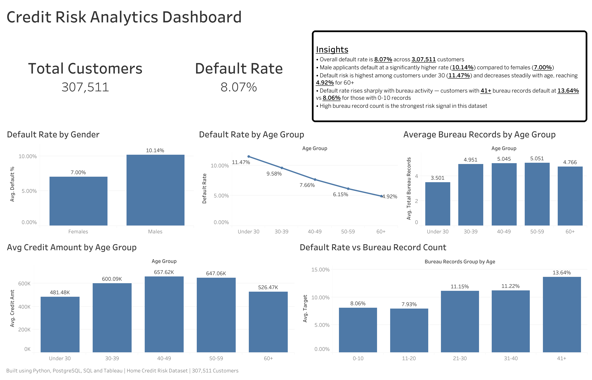

# Credit Risk Analytics Dashboard

An end-to-end credit risk analysis project that identifies default patterns across 307,511 loan applicants using SQL, Python, and PostgreSQL — visualized through an interactive Tableau dashboard.

---

## 🔍 Problem Statement

Credit default is one of the biggest risks for financial institutions. Identifying which customer segments are most likely to default — and why — enables better lending decisions and risk management.

This project analyzes real-world home credit data to uncover default patterns across demographics, income levels, age groups, and credit bureau activity.

---

## 🏗️ Project Architecture

1. Raw Data — Kaggle (Home Credit Default Risk)
2. PostgreSQL — Data storage and SQL analysis
3. Python (Pandas) — Data cleaning and feature engineering
4. Processed Dataset — analytics_customer_final
5. Tableau Public — Interactive dashboard


---

## 📊 Dashboard

🔗 [View Live Dashboard on Tableau Public](https://public.tableau.com/app/profile/kumar.saksham2703/viz/CreditRiskAnalysis_17802306468670/CreditRiskAnalyticsDashboard?publish=yes)

[](Dashboard.png)

---

## 📈 Key Findings

| Metric | Value |
|---|---|
| Total Customers Analyzed | 3,07,511 |
| Overall Default Rate | 8.07% |
| Highest Risk Segment | Under 30 (11.47%) |
| Lowest Risk Segment | 60+ (4.92%) |
| Male Default Rate | 10.14% |
| Female Default Rate | 7.00% |
| Default Rate — 41+ Bureau Records | 13.64% |
| Default Rate — 0–10 Bureau Records | 8.06% |

---

## 🔬 Analysis Layers

### Demographics Analysis
- Default rate broken down by **gender** and **age group**
- Younger customers (Under 30) are highest risk despite having less credit history
- Males default at 45% higher rate than females

### Bureau Records Risk Analysis
- Customers grouped into bureau risk tiers: Low (0–10) → Moderate → High → Very High → Extreme (41+)
- Strong positive correlation between bureau activity and default rate
- Customers with 41+ bureau records default at nearly **1.7x the rate** of low-activity customers

### Income Distribution
- Majority of customers earn between ₹1,00,000 – ₹1,50,000 annually
- Income distribution is right-skewed with few high earners
- Income alone is not a strong predictor of default

---

## 🛠️ Tech Stack

| Tool | Usage |
|---|---|
| Python (Pandas) | Data cleaning, feature engineering, CSV export |
| PostgreSQL + pgAdmin | Data storage, SQL queries, transformations |
| SQL | Aggregations, joins, window functions |
| Tableau Public | Interactive dashboard and visualizations |
| JupyterLab | Notebook environment |

---

## 📂 Project Structure

```text
credit-risk-analytics-dashboard/
│
├── data/
│
├── notebooks/
│
├── sql/
│   ├── kpis/
│   ├── customer_segmentation/
│   ├── risk_analysis/
│   └── advanced_analysis/
│
├── Tableau/
│
├── Dashboard.png
│
└── .gitignore
```
---

## ⚙️ Data Setup

Raw files are not included due to GitHub size limits.

1. Clone the repository
   `git clone https://github.com/Saksham3124/credit-risk-analytics.git`

2. Download data from [Kaggle — Home Credit Default Risk](https://www.kaggle.com/c/home-credit-default-risk/data)

3. Place files in `data/raw/`:
   - `application_train.csv`
   - `bureau.csv`
   - `previous_application.csv`

4. Run notebooks in order to generate processed data


---

## 🔑 Key SQL Techniques Used

```sql
-- Default rate by age group
SELECT age_group,
       AVG(target) AS default_rate,
       COUNT(*) AS total_customers
FROM analytics_customer
GROUP BY age_group
ORDER BY default_rate DESC;

-- Bureau records risk bucketing
SELECT
  CASE
    WHEN total_bureau_records BETWEEN 0 AND 10 THEN 'Low'
    WHEN total_bureau_records BETWEEN 11 AND 20 THEN 'Moderate'
    WHEN total_bureau_records BETWEEN 21 AND 30 THEN 'High'
    WHEN total_bureau_records BETWEEN 31 AND 40 THEN 'Very High'
    ELSE 'Extreme'
  END AS bureau_risk_group,
  AVG(target) AS default_rate
FROM analytics_customer
GROUP BY bureau_risk_group;
```

---

## 👤 Author

**Kumar Saksham**
[GitHub](https://github.com/Saksham3124) | [Tableau Public](https://public.tableau.com/app/profile/kumar.saksham2703)
